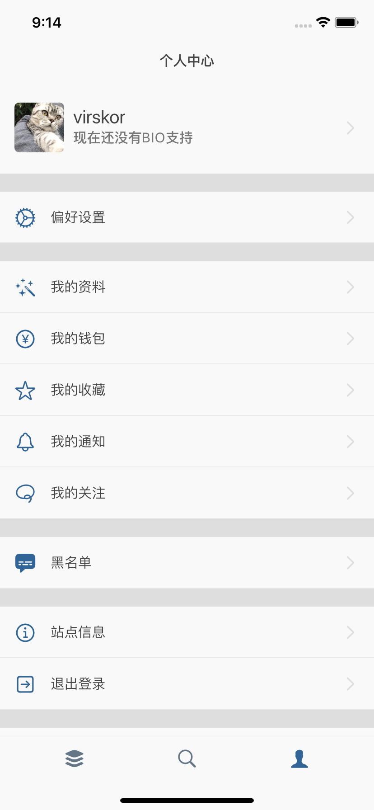
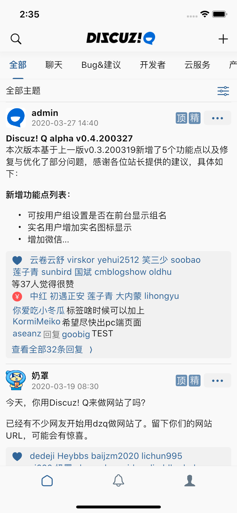
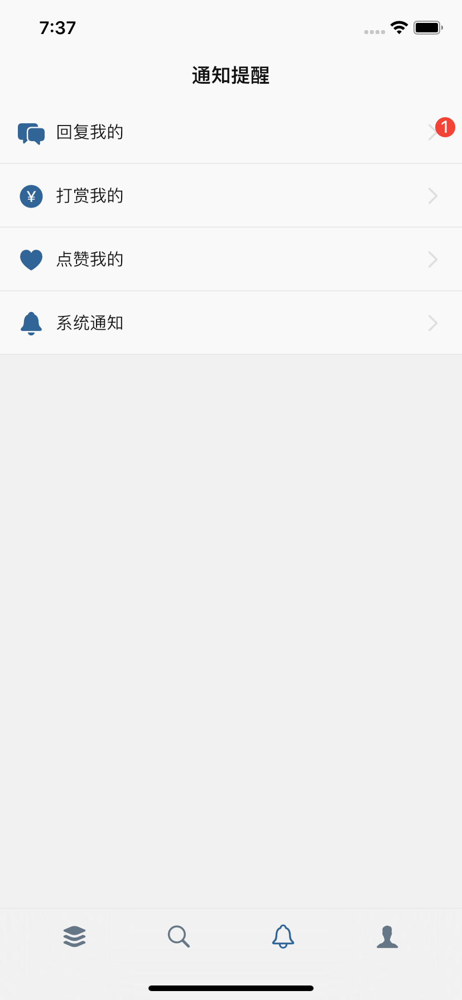
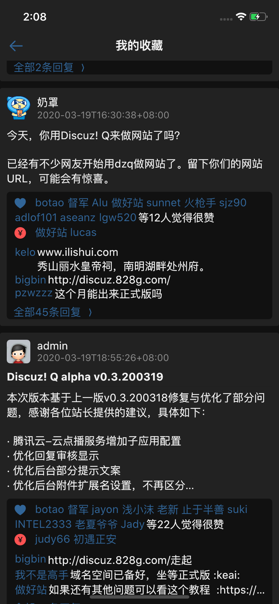
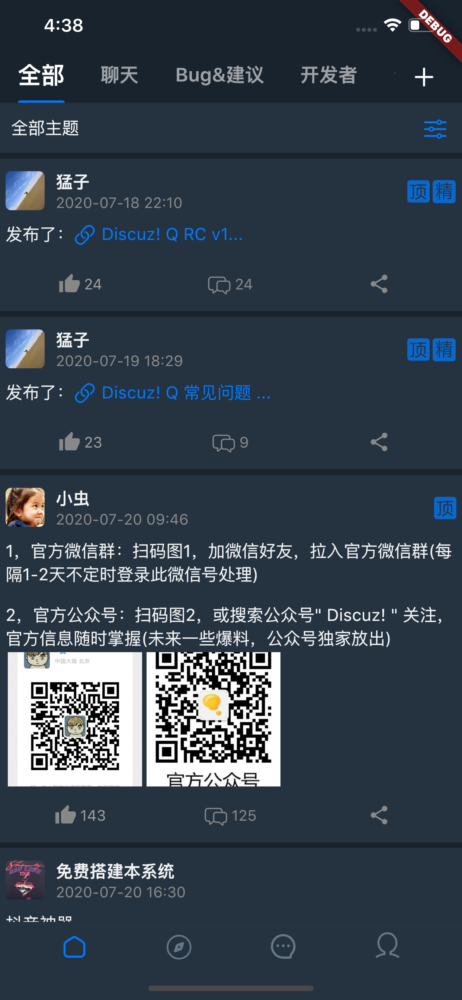
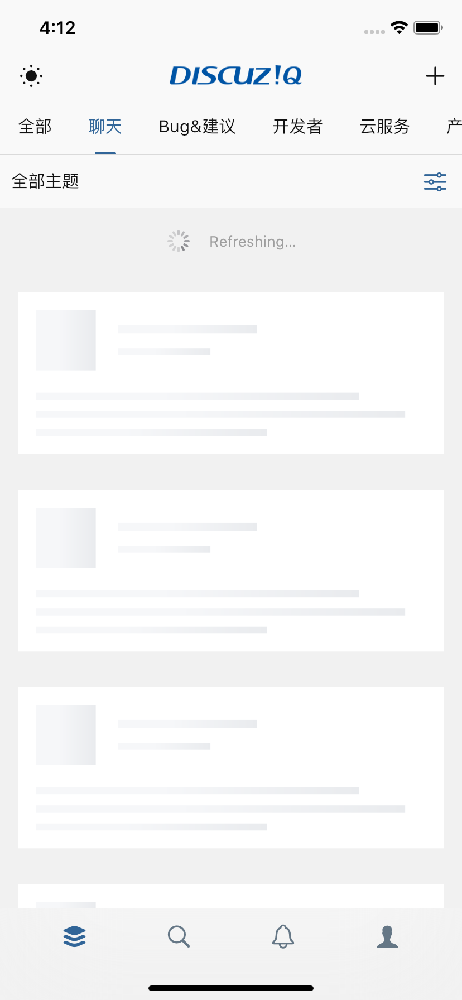
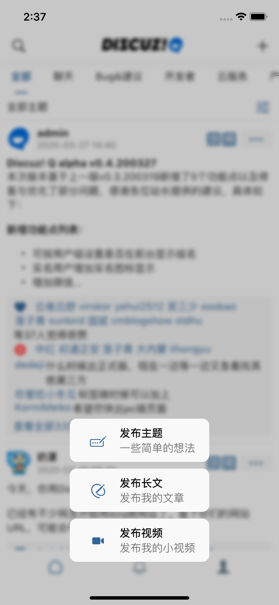
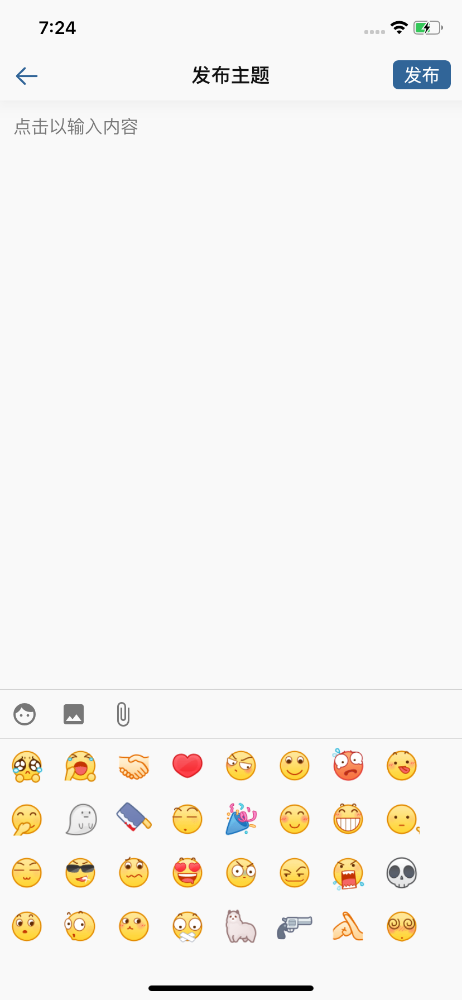

<p align="center">
 
 
</p> 
<p align="center">
<a href="https://github.com/virskor/DiscuzQ/releases"></a> 
<a href="https://github.com/virskor/DiscuzQ/blob/master/LICENSE"></a> 
</p> 
<p align="center">该项目的诞生，离不开Discuz DNSPod TencentCloud 的贡献</p>

### 说明
最近我没有按时更新给大家带来的不便还希望大家体谅。后续会逐渐恢复更新的，说明于2020年11月14日。
如果有疑问请微信留言或者在下面的网址反馈，谢谢。   
https://www.clodra.com

### 当前分支兼容的Discuz!Q 版本
注意，当您使用这份代码生成APP时，需要保证您使用的后端版本与下面标注的API适配版本标注一致。否则将无法正常运行。  
Discuz! Q RC v2.1.201113

我们的review于11月26日开始  
### 计划
最近会计划恢复并完成下面的项目， ✅代表以及完成  
**✅ 用户隐私政策，协议**  
**✅ 站点关闭提示**  
**✅ 使用路由管理页面（先新增路由管理类，后期逐渐全部路由化）**  
**✅ 发现页分类**  
**✅ 用户注册验证码校验支持**  
**✅ 核心组件抽出(部分组件已经抽出到core，后续将分离为mobile, web等)**  
**✅ 将ScopedModels更改为Provider**   
**✅ BUGLY运营统计**  
**✅  安卓更新解决方案 BUGLY**  
**短信验证码**  
**在消息评论中回复**  
**编辑器优化**  
**问答支持**  
**批量传图**  
**支持商品**  
**UI将大致与h5 uniApp保持一致**  
**微信登录**  
**权限购买**  
**微信登录**  
**钱包，订单(安卓)**  
**Flutter APP 正式版**  

## About DiscuzQ Flutter  
这是一个基于DiscuzQ 第三方开发的Flutter跨平台APP，要知道使用这些代码是免费的。但基于你取得DiscuzQ的授权。

### 实现目标
基本上和官方版本是保持一致的，只是会增加黑暗模式，主题颜色，字体大小等设置罢了。

## 限制
现在的版本还有一些限制，并且这些限制需要后续的版本中逐渐更新来解决，不意味着不会被解决。这是因为APP上架策略，或者现有的SDK暂时不能支持，需要自行封装等。  
不支持付费模式的站点  
不支持打赏，钱包等金融相关的功能  

## 版权说明
第三方APP，不代表Discuz团队，仅做个人学习使用。该Flutter APP将不考虑支持Web。  
该APP现在处于开发阶段，暂时不推荐clone并编译，后续编排改动都很大，直到release前暂不要使用这些代码。  

### 贡献
他们参与了这个项目，并为此做出贡献，排名不分先后  
#### 编译相关
[奶罩大佬 提供了自动化build脚本](https://github.com/naizhao/Build-Discuz-Q-Flutter)

### 一起开发
了解开发进度，或者有疑问，可以加我微信奥
<p> </p>
<p> </p>


## 最近UI截屏
<p> 
 
  
  
  
    
  
  


</p> 

### 在现有的Flutter项目中引用DiscuzQ
参考mobile中，的pubspec.ymal 和 lib/main.dart 即可一步集成。！ 同时也不要忘记复制mobile中的assets目录 


### 开发提示
从2020年12月5日的版本开始，我们将widgets抽出到./core下，所以，你只需要修改./core下的代码。使用vscode打开core文件夹。然后在terminal中执行下面的代码进行调试。
```
cd ../
cd mobile
flutter run
```   
 
mobile目录是用来编译调试的。而组件被抽出为flutter package.这样一来方便大家更改mobile中的包名。直接用命令行编译apk或者ipa。后续还会把core中涉及原生的API部分抽出，使得这个项目支持web。  
现在，我们的仓库每日都有新的commit，这样一来代码变动都是很大的，并且很多功能都没有完成，你可能跑步起来或者跑起来了还有很多问题。我们将在基础功能完成后，进行很大的Code Review工作和测试工作，现在请不要将代码用于生产环境的构建。  

详细关注Release Tags  
后续我们会给出一个Release文档，在代码Review后，我们会做一些改变和文档，让你知道如何复用组件，以及继续开发自己想要的功能。  


## 注意
This application dose not have released any version. checkout dev branch to get latest version or contribute it. Thanks.  
This is an third party software.  
Find API document at: https://discuz.chat/api-docs/v1/

Please add this code into your stateful widget  
```dart
@override
void setState(fn) {
    if (!mounted) {
        return;
    }
    super.setState(fn);
}

@override
void initState() {
    super.initState();
}

@override
void dispose() {
    super.dispose();
}
```

## 启动调试
### 调试前请了解
首先，要确认你的Flutter版本
```yaml
environment:
  sdk: ">=2.8.0 <3.0.0"
```

```
minSdkVersion 20
targetSdkVersion 29
```
你可以使用命令行开启调试，如果你使用android studio，你可以直接运行。  
不过在此之前值得说明的是，如果你的网络不能正常快速访问一些技术类网站，建议你使用pub国内源，你可以搜索找到配置的方式。  
请使用最新版的Flutter，即Flutter v1.22 +
```sh
cd ./mobile
flutter run
```
项目中的 ./packages 本地化了一些依赖，这些依赖有改动所以没有直接使用pub.dev中的进行安装。 


### Android Release or debug
我们推荐使用IOS模拟器开始你的调试，如果你Build Android版本，首先你需要生成一个keystore文件，存储到 ./mobile/android/目录下，并命名为android.keystore   
接下来，将同目录下的 key.properties.example 文件修改为 key.properties 并更新里面的签名配置内容。切记不要将其提交到Git，这些签名文件是涉及安全的。其次你还可以根据需要修改gradle文件，我们默认下使用了国内的源。

### IOS Release or debug
需要修改Xcode 中的Team, 这样来完成签名，之后，不用做太多你便可以Build。 如果你Pod无法执行install，请使用国内源或者代理(推荐)。 其次
```sh
cd ./mobile
flutter clean
flutter pub get
cd /ios
sudo rm -rf Podfile.lock
pod install #手动安装IOS相关依赖
```
推荐直接打开core目录进行开发，不用理会packages等目录，这些文件为第三方包，可能会有很多problems提示，这样会打扰您查看core目录下的PROBLEMS
```sh
cd ./mobile
flutter run
```

### 使用不同的信息来作用在开发和生产环境
在生产或者开发时你可能需要访问不同的业务后端域名。现在你可以更改或者输入下面的信息到 ./mobile/build.yaml。但在这之前请先打开 ./mobile/build.yaml中的文件描述，来确定这些设置的作用或者关于风险的描述。   
你可能需要在git repo上面的mobile/build.yaml查找更多可以支持的设置，下面的代码仅展示部分设置。  
每个项目都不可以缺少下面的配置信息，其他的信息可以忽略，或者在后面不断开发的过程中你可以自定义。  
实际上build的过程中，你可以在build script构建过程中重新生成一个build.yaml完成快速构建，这个build.yaml在生产时仅需要包含production 下配置描述，或者只选其中一个选项来覆盖APP默认BuildInfo模型的数据。  
https://self-signed.badssl.com/
```yaml
development:
  domain: https://example.chat
  appname: DiscuzQ
  ## DO NOT ENABLE THIS ITEM WHEN YOU ARE BUILD AN APPLICATION FOR YOUR USERS
  enablePerformanceOverlay: false
# 构建生产环境的APP时加载的信息
# Parameters for building prodution package
production:
  domain: https://discuz.chat
  appname: DiscuzQ
  ## DO NOT ENABLE THIS ITEM WHEN YOU ARE BUILD AN APPLICATION FOR YOUR USERS
  enablePerformanceOverlay: false
```
### HTTP2的支持
build.yaml 中有可选参数，默认情况下HTTP2将不被开启，需要更改build.yaml中的设置，例:
```yaml
production:
  # 开启HTTP2 有链接复用、头部压缩、二进制传输、服务端推送等重多特性
  # 暂时不建议开启，因Flutter HTTP2实测下来PUT 或者一些情况下，根本无法完成请求
  # 你可能会获得 flutter: HTTP/2 error: Stream error: Stream was terminated by peer (errorCode: 1). 的错误
  enableHttp2: false
  # 证书无法校验时，是否继续请求(忽略非法的证书)
  # 注意 onBadCertificate 即便没有开启 HTTP2 的支援，也会作用的
  onBadCertificate: true 
  # 当请求完成时，连接默认继续保持15000 ms(15秒)，通过idleTimeout来自定义保持时间
  http2idleTimeout: 15000
```
### 金融相关的功能
实际上，现在我们还不支援这些特性，不过预先设计您可以在Build时，抹去这些功能和您实际情况所相符。  
现在不建议开启financial。

```yaml
production:
  # 钱包，等金融数字等功能都会被隐藏
  financial: false 
```

### 使用移动统计代码
修改build.yaml中的Umeng相关配置即可。这里为了支持BUG上报，所以仅支持腾讯全家桶BUGLY。


## 生成发布
可能有的开发者刚开始接触Flutter按照上面的指引运行起来APP后顿时感觉卡顿，实际上flutter run是运行的Debug模式，Debug下性能表现和Release是有很大差异的。如果体验用于生产的，应该使用下面的命令。
R8 是谷歌推出的最新代码压缩器，当你打包 release 版本的 APK 或者 AAB 时会默认开启。要关闭 R8，请向 flutter build apk 或 flutter build appbundle 传 --no-shrink 标志。
```
flutter build apk --release --no-shrink
```

因IOS为提供签名flutter build ios无法build,这时需要使用xcode来archive，而不是使用Flutter build. 而IOS 参考自动化构建所需要的。

[参考编译文档]推荐使用[奶罩大佬的CI](https://github.com/naizhao/Build-Discuz-Q-Flutter)进行编译。


### 源相关
如果你无法Build，那么你可能需要更改Gradle 源 pub源，关于Pub源，建议搜索 flutter China相关内容。 gradle源，则需要注意下面的信息。  
我们使用了默认的源配置，但是我们也增加了国内源，建议根据情况修改 ./mobile/andorid/build.gradle 。 你可能需要重复尝试很多次，才能正常build，这取决于你的网络情况。
```gradle
repositories {
    // maven { url 'http://maven.aliyun.com/nexus/content/groups/public' }
    // maven{ url 'http://maven.aliyun.com/nexus/content/repositories/google'}
    // maven{ url 'http://maven.aliyun.com/nexus/content/repositories/jcenter'}
    google() // 使用国内源，解除上面的注释
    jcenter()
}
```

## 如何自定义主体颜色，字体大小
App自设计开始就设计了支持主题模式，所以你可以在lib/ui/ui.dart修改对应的参数，在lib/utils/global.dart中修改对应的参数完整定制。  
使用命令行一键生成APP的图标和启动图(todo)。

### 如何自动生成Android 和 IOS 的应用图标
我们使用了flutter_launcher_icons， 这使得你可以快速生成一个自己的App图标，但是这样一来你就不可以改变默认的工程配置。   
详细的办法参考：https://pub.dev/packages/flutter_launcher_icons   
我们已经在pubspec.yaml添加了相关配置，你需要做的就是替换 assets/images/app.png
注意，图片不能包含alpha通道否则会导致Appstore上架失败等，生成图标时，在项目目录运行命令即可自动生成，无需其他操作。   
```sh
flutter pub run flutter_launcher_icons:main
# or
# cd ./mobile
# bash icon
```

### 如何自动生成Android 和 IOS的启动图
和生成图标一样，超级简单。我们已经在pubspec.yaml添加了相关配置，你需要做的就是替换 assets/images/splash.png。然后在运行下面的命令行就可以啦！ 
如果要修改包名，需要在生成前进行修改防止启动时闪退

```sh
flutter pub pub run flutter_native_splash:create
# or
# cd ./mobile
# bash splas
```