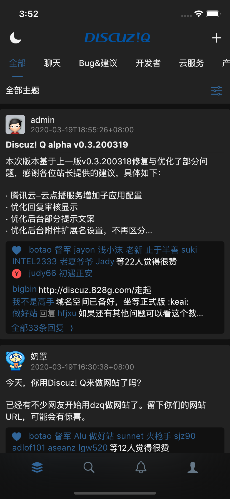

<p align="center">
 
 
</p> 
<p align="center">该项目的诞生，离不开Discuz DNSPod TencentCloud 的贡献</p>

## About DiscuzQ Flutter  
  
这是一个基于DiscuzQ 第三方开发的Flutter跨平台APP，要知道使用这些代码是免费的。但基于你取得DiscuzQ的授权。

### 实现目标
基本上和官方版本是保持一致的，只是会增加黑暗模式，主题颜色，字体大小等设置罢了。
* 考虑接入腾讯云短视频SDK
A new Flutter application for DiscuzQ. This Application is still under developing, this is an open source software.  

If you have any question about this project, follow and post an issue. I will consit to write this application.

## 限制
现在的版本还有一些限制，并且这些限制需要后续的版本中逐渐更新来解决，不意味着不会被解决。这是因为APP上架策略，或者现有的SDK暂时不能支持，需要自行封装等。  
不支持付费模式的站点  
不支持开启腾讯云防水墙的站点发帖  
不支持打赏，钱包等金融相关的功能  

## 版权说明
第三方APP，不代表Discuz团队，仅做个人学习使用。该Flutter APP将不考虑支持Web。  
该APP现在处于开发阶段，暂时不推荐clone并编译，后续编排改动都很大，直到release前暂不要使用这些代码。  

### 贡献
他们参与了这个项目，并为此做出贡献，排名不分先后  
[奶罩大佬 提供了自动化build脚本](https://github.com/naizhao/Build-Discuz-Q-Flutter)


### 开发提示
现在，我们的仓库每日都有新的commit，这样一来代码变动都是很大的，并且很多功能都没有完成，你可能跑步起来或者跑起来了还有很多问题。我们将在基础功能完成后，进行很大的Code Review工作和测试工作，现在请不要将代码用于生产环境的构建。  

详细关注Release Tags  
后续我们会给出一个Release文档，在代码Review后，我们会做一些改变和文档，让你知道如何复用组件，以及继续开发自己想要的功能。  

## 最近UI截屏
<p> 
 
  
  
  
  
  
  
  
  


</p> 

### 一起开发
了解开发进度，或者有疑问，可以加我微信奥
<p> </p>

## 一些隐藏的功能
有的时候因为不同需要，有的功能可能开发了，但是并没有直接启用，因为这些功能取决于你的后端情况或者偏好。
### HTTP2的支持
默认情况下APP没有开启HTTP2请求，如果你的站点开启了HTTP2，那么你可以使用这个特性。在./utils/request/Request.dart中找到下面的代码进行注释解除。   
```dart
/// import 'package:dio_http2_adapter/dio_http2_adapter.dart';

    /// http2支持，如果你开启了HTTP2，那么移除注释，默认情况下是不启用的
    // _dio.httpClientAdapter = Http2Adapter(
    //   ConnectionManager(
    //     idleTimeout: 10000,

    //     /// Ignore bad certificate
    //     onClientCreate: (_, clientSetting) =>
    //         clientSetting.onBadCertificate = (_) => true,
    //   ),
    // );

```

## 注意
This application dose not have released any version. checkout dev branch to get latest version or contribute it. Thanks.  
This is an third party software.  
Find API document at: https://discuz.chat/api-docs/v1/

Please add this code into your stateful widget  
```dart
@override
void setState(fn) {
    if (!mounted) {
        return;
    }
    super.setState(fn);
}

@override
void initState() {
    super.initState();
}

@override
void dispose() {
    super.dispose();
}
```

## 启动调试
### 调试前请了解
首先，要确认你的Flutter版本
```yaml
environment:
  sdk: ">=2.6.0 <3.0.0"
```
你可以使用命令行开启调试，如果你使用android studio，你可以直接运行。  
不过在此之前值得说明的是，如果你的网络不能正常快速访问一些技术类网站，建议你使用pub国内源，你可以搜索找到配置的方式。  
现阶段的调试，至少要beta以上版本，或者dev。因为我们采用了最新的Flutter特性，以便后续不用调整一些代码。即Flutter v1.15 +
```sh
flutter channel beta
cd ./discuz
flutter run
```
项目中的 ./packages 本地化了一些依赖，这些依赖有改动所以没有直接使用pub.dev中的进行安装。 

### 使用不同的信息来作用在开发和生产环境
在生产或者开发时你可能需要访问不同的业务后端域名。现在你可以更改或者输入下面的信息到 ./discuz/build.yaml。但在这之前请先打开 ./discuz/build.yaml中的文件描述，来确定这些设置的作用或者关于风险的描述。   
每个项目都不可以缺少下面的配置信息，其他的信息可以忽略，或者在后面不断开发的过程中你可以自定义。  
实际上build的过程中，你可以在build script构建过程中重新生成一个build.yaml完成快速构建，这个build.yaml在生产时仅需要包含production 下配置描述，或者只选其中一个选项来覆盖APP默认BuildInfo模型的数据。
```yaml
development:
  domain: https://example.chat
  appname: DiscuzQ
  ## DO NOT ENABLE THIS ITEM WHEN YOU ARE BUILD AN APPLICATION FOR YOUR USERS
  enablePerformanceOverlay: false
# 构建生产环境的APP时加载的信息
# Parameters for building prodution package
production:
  domain: https://discuz.chat
  appname: DiscuzQ
  ## DO NOT ENABLE THIS ITEM WHEN YOU ARE BUILD AN APPLICATION FOR YOUR USERS
  enablePerformanceOverlay: false
```

### Android Release or debug
我们推荐使用IOS模拟器开始你的调试，如果你Build Android版本，首先你需要生成一个keystore文件，存储到 ./discuz/android/目录下，并命名为android.keystore   
接下来，将同目录下的 key.properties.example 文件修改为 key.properties 并更新里面的签名配置内容。切记不要将其提交到Git，这些签名文件是涉及安全的。其次你还可以根据需要修改gradle文件，我们默认下使用了国内的源。

### IOS Release or debug
需要修改Xcode 中的Team, 这样来完成签名，之后，不用做太多你便可以Build。 如果你Pod无法执行install，请使用国内源或者代理(推荐)。 其次
```sh
cd ./discuz
flutter clean
flutter pub get
cd /ios
sudo rm -rf Podfile.lock
pod install #手动安装IOS相关依赖
```
推荐直接打开discuz目录进行开发，不用理会packages等目录，这些文件为第三方包，可能会有很多problems提示，这样会打扰您查看discuz目录下的PROBLEMS

### 源相关
如果你无法Build，那么你可能需要更改Gradle 源 pub源，关于Pub源，建议搜索 flutter China相关内容。 gradle源，则需要注意下面的信息。  
我们使用了默认的源配置，但是我们也增加了国内源，建议根据情况修改 ./discuz/andorid/build.gradle 。 你可能需要重复尝试很多次，才能正常build，这取决于你的网络情况。
```gradle
repositories {
    // maven { url 'http://maven.aliyun.com/nexus/content/groups/public' }
    // maven{ url 'http://maven.aliyun.com/nexus/content/repositories/google'}
    // maven{ url 'http://maven.aliyun.com/nexus/content/repositories/jcenter'}
    google() // 使用国内源，解除上面的注释
    jcenter()
}
```


## 性能相关
可能有的开发者刚开始接触Flutter按照上面的指引运行起来APP后顿时感觉卡顿，实际上flutter run是运行的Debug模式，Debug下性能表现和Release是有很大差异的。如果体验用于生产的，应该使用下面的命令。
```
flutter run --release
```

## 如何自定义主体颜色，字体大小
App自设计开始就设计了支持主题模式，所以你可以在lib/ui/ui.dart修改对应的参数，在lib/utils/global.dart中修改对应的参数完整定制。  
使用命令行一键生成APP的图标和启动图(todo)。

### 如何自动生成Android 和 IOS 的应用图标
我们使用了flutter_launcher_icons， 这使得你可以快速生成一个自己的App图标，但是这样一来你就不可以改变默认的工程配置。   
详细的办法参考：https://pub.dev/packages/flutter_launcher_icons   
我们已经在pubspec.yaml添加了相关配置，你需要做的就是替换 assets/images/app.png
注意，图片不能包含alpha通道否则会导致Appstore上架失败等，生成图标时，在项目目录运行命令即可自动生成，无需其他操作。   
```sh
flutter pub run flutter_launcher_icons:main
# or
# cd ./discuz
# bash icon
```

### 如何自动生成Android 和 IOS的启动图
和生成图标一样，超级简单。我们已经在pubspec.yaml添加了相关配置，你需要做的就是替换 assets/images/splash.png。然后在运行下面的命令行就可以啦！ 

```sh
flutter pub pub run flutter_native_splash:create
# or
# cd ./discuz
# bash splas
```
### 自定义隐私政策和条款
默认情况下，会考虑自动加载DZ中设置的隐私政策和条款。现在DZ API还没有这个功能，后续会加入。但是除了使用默认的DZ后台设置的协议，你还可以指定。  
如果你指定了隐私政策协议，那么你可以再 ./utils/global.dart中设置下面的代码。
```dart
  /// 
  /// 隐私政策和用户协议常规不需要设置
  /// 若设置后将指定打开链接内的用户协议
  /// 默认情况下，程序设计自动加载dz中设置的协议
  /// 该配置项根据需要来开启
  /// 
  /// 隐私协议
  static const String privacyUri = '';

  ///用户协议
  static const String policiesUri = '';
```